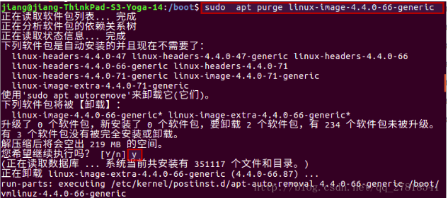
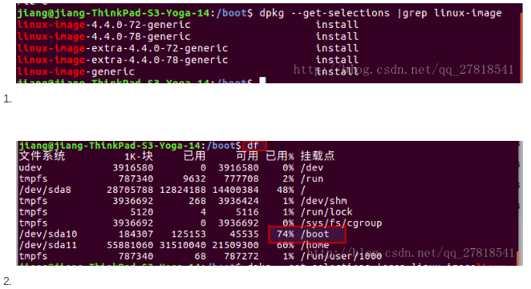

[TOC]

# boot空间不足解决办法

## 前言

在安装ubuntu的时候, 根据网上教程给其分配了单独的物理分区, 大小为200M. 然而每当系统升级的时候, 旧的内核版本并不会被清理, 升级几次就提示boot内存不足了. 思路就是卸载旧的版本内核, 腾出空间, 记录下自己尝试过的命令.

## 正常的删除步骤

1. 查看系统已经安装的内核版本

   > dpkg --get-selections | grep linux-image

   

2. 查看系统当前使用的内核版本(我的是`4.4.0-72-generic`)

   > uname -a

   

3. sudo apt purge linux-image-4.4.0-66-generic删除旧的内核版本(分别针对不同标识)

   * install`说明：系统已经安装了相应的内核, 使用purge命令删除相应的内核`

     > sudo apt purge linux-image-4.4.0-66-generic

     

   * deinstall`说明：系统没有安装此内核, 但是在配置文件中还残留它的信息(有可能是以前卸载的时候不彻底)`

     > sudo dpkg -P linux-image-extra-4.4.0-31-generic

     

4. 最后看下效果

   

## 执行过程中可能出现的错误以及解决办法

这个依据个人实际情况而定, 有的人按照上面的步骤就成功了. 如果出现错误请继续往下看.

1. 执行卸载命令**(sudo apt purge linux-image-4.4.0-66-generic)**时报错:

    ```shell
    正在读取软件包列表... 完成
    正在分析软件包的依赖关系树
    正在读取状态信息... 完成
    您可能需要运行“apt-get -f install”来纠正下列错误：
    下列软件包有未满足的依赖关系：
    linux-image-extra-4.4.0-66-generic : 依赖: linux-image-4.4.0-66-generic 但是它将不会被安装
    linux-image-extra-4.4.0-78-generic : 依赖: linux-image-4.4.0-78-generic 但是它将不会被安装
    linux-image-generic : 依赖: linux-image-4.4.0-78-generic 但是它将不会被安装
    E: 有未能满足的依赖关系. 请尝试不指明软件包的名字来运行“apt-get -f install”(也可以指定一个解决办法). 123456789
    ```

    修复办法:

    > 错误提示很明显了, 有的软件包缺少依赖关系, 建议我们修复.
    > 那我们就执行命令：**sudo apt -f install**

2. 执行修复命令(**sudo apt -f install**)时报错:

    ```shell
    正在读取软件包列表... 完成
    正在分析软件包的依赖关系树
    正在读取状态信息... 完成
     .......
    gzip: stdout: No space left on device
    E: mkinitramfs failure find 141 cpio 141 gzip 1
    update-initramfs: failed for /boot/initrd.img-4.4.0-75-generic with 1.
    run-parts: /etc/kernel/postinst.d/initramfs-tools exited with return code 1
    dpkg: 处理软件包 linux-image-extra-4.4.0-75-generic (--configure)时出错：
     子进程 已安装 post-installation 脚本 返回错误状态 1
    在处理时有错误发生：
     linux-image-extra-4.4.0-71-generic
     linux-image-extra-4.4.0-72-generic
     linux-image-extra-4.4.0-75-generic
    E: Sub-process /usr/bin/dpkg returned an error code (1)123456789101112131415
    ```

    解决办法：

    > gzip: stdout: No space left on device 这句话是说在/boot空间下没有足够的空间了. why?？？？
    >
    > 原因是这样：在修复的时候需要下载依赖包, 然而在/boot下本来就没有多余的空间了, 所以无法修复依赖的问题. 这就产生死循环了, 为了省出更多boot空间需要删除旧的内核, 删除旧的内核时又需要修复一些依赖, 修复依赖就需要下载依赖包, 而boot空间下本来就满了, (⊙ｏ⊙)…
    >
    > **解决办法**就是先把boot空间下几个比较大的文件暂存到别的文件夹, 腾出来足够的空间来修复依赖, 等依赖修复好了并且删除了旧的内核后再迁移回来(如果文件没什么用处就不用迁移回来了).
    >
    > 修复好了, 再次执行卸载命令**(sudo apt purge linux-image-xxx)**, 把没用的旧内核都删掉, 一切都OK了.


## 参考

<https://blog.csdn.net/qq_27818541/article/details/72675954>
