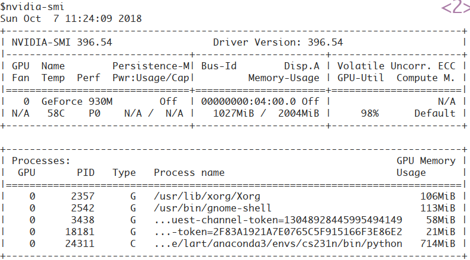

[TOC]

# nvidia-smi

```shell
# 连续观察 0.1s刷新一次
watch -n -9 nvidia-smi

# 表示运行test.py文件时, 使用编号为0的GPU卡
export CUDA_VISIBLE_DEVICES=0 python test.py
# 表示运行test.py文件时, 使用编号为0和2的GPU卡
export CUDA_VISIBLE_DEVICES=0,2 python test.py
```



上面的表格中：

* 第一栏的Fan：N/A是风扇转速, 从0到100%之间变动, 这个速度是计算机期望的风扇转速, 实际情况下如果风扇堵转, 可能打不到显示的转速. 有的设备不会返回转速, 因为它不依赖风扇冷却而是通过其他外设保持低温).
* 第二栏的Temp：是温度, 单位摄氏度.
* 第三栏的Perf：是性能状态, 从P0到P12, P0表示最大性能, P12表示状态最小性能.
* 第四栏下方的Pwr：是能耗, 上方的Persistence-M：是持续模式的状态, 持续模式虽然耗能大, 但是在新的GPU应用启动时, 花费的时间更少, 这里显示的是off的状态.
* 第五栏的Bus-Id是涉及GPU总线的东西, domain:bus:device.function
* 第六栏的Disp.A是Display Active, 表示GPU的显示是否初始化.
* 第五第六栏下方的Memory Usage是显存使用率.
* 第七栏是浮动的GPU利用率.
* 第八栏上方是关于ECC的东西.
* 第八栏下方Compute M是计算模式.
* 下面一张表示每个进程占用的显存使用率.

**显存占用和GPU占用是两个不一样的东西**, 显卡是由GPU和显存等组成的, 显存和GPU的关系有点类似于内存和CPU的关系.

## 参考

* <https://blog.csdn.net/qq_36427732/article/details/79017835?utm_source=copy>
* <https://blog.csdn.net/sallyxyl1993/article/details/62220424?utm_source=copy>
